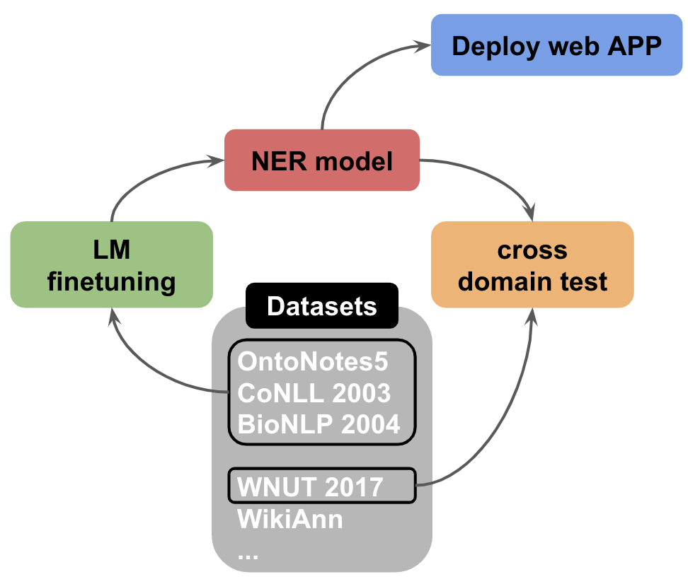
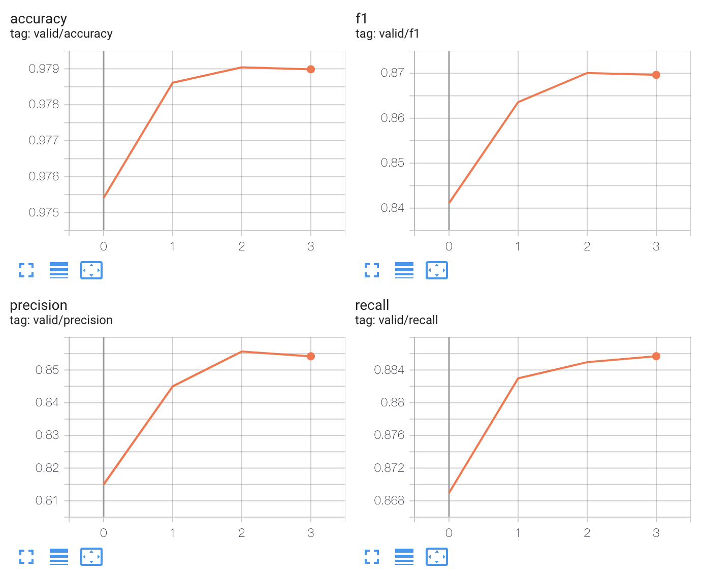
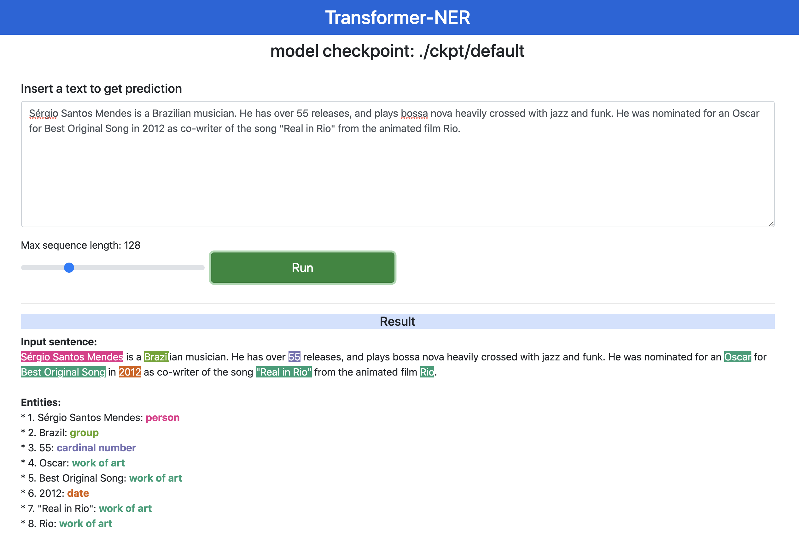

# T-NER: Transformers NER  

<p align="center">
  
</p>


***`T-NER`*** is a python tool to analyse language model finetuning on named-entity-recognition (NER). 
It has an easy interface to finetune models, test on cross-domain datasets, where we compile 9 publicly available NER datasets.
Models can be deployed immediately on our web app for qualitative analysis, and the API for a micro service.
Also we release all the NER model checkpoints, where the most generalized model trained on all the dataset, has 43 entity types.    
 
### Table of Contents  
1. **[Setup](#get-started)**
2. **[Language Model Finetuning on NER](#language-model-finetuning-on-ner)**
    - *[Datasets](#datasets):* Built-in datasets and custom dataset
    - *[Model Finetuning](#model-finetuning):* Model training [colab notebook](https://colab.research.google.com/drive/1AlcTbEsp8W11yflT7SyT0L4C4HG6MXYr?usp=sharing)
    - *[Model Evaluation](#model-evaluation):* In/out of domain evaluation [colab notebook](https://colab.research.google.com/drive/1jHVGnFN4AU8uS-ozWJIXXe2fV8HUj8NZ?usp=sharing)
    - *[Model Inference API](#model-inference-api):* An API to get prediction from models
    - *[Model Checkpoints](#model-checkpoints)* : Released model checkpoints
3. **[Experiment with XLM-R](#experiment-with-xlm-r):** Cross-domain analysis of XLM-R
4. **[Web API](#web-app):** Model deployment on a web-app   

## Get Started
Install via pip
```shell script
pip install git+https://github.com/asahi417/tner
```

or clone and install libraries.
```shell script
git clone https://github.com/asahi417/tner
cd tner
pip install -r requirement.txt
```

## Language Model Finetuning on NER

<p align="center">
  
  <br><i>Fig 1: Tensorboard visualization</i>
</p>

### Datasets
Following built-in NER datasets are available via `tner`.   

|                                   Name (`alias`)                                                                      |         Genre        |    Language   | Entity types | Data size (train/valid/test) | Note |
|:---------------------------------------------------------------------------------------------------------------------:|:--------------------:|:-------------:|:------------:|:--------------------:|:-----------:|
| OntoNotes 5 ([`ontonotes5`](https://www.aclweb.org/anthology/N06-2015.pdf))                                           | News, Blog, Dialogue | English       |           18 |   59,924/8,582/8,262 |  | 
| CoNLL 2003 ([`conll2003`](https://www.aclweb.org/anthology/W03-0419.pdf))                                             | News                 | English       |            4 |   14,041/3,250/3,453 |  |
| WNUT 2017 ([`wnut2017`](https://noisy-text.github.io/2017/pdf/WNUT18.pdf))                                            | SNS                  | English       |            6 |    1,000/1,008/1,287 |  |
| FIN ([`fin`](https://www.aclweb.org/anthology/U15-1010.pdf))                                                          | Finance              | English       |            4 |          1,164/-/303 |  |
| BioNLP 2004 ([`bionlp2004`](https://www.aclweb.org/anthology/W04-1213.pdf))                                           | Chemical             | English       |            5 |       18,546/-/3,856 |  |
| BioCreative V CDR ([`bc5cdr`](https://biocreative.bioinformatics.udel.edu/media/store/files/2015/BC5CDRoverview.pdf)) | Medical              | English       |            2 |    5,228/5,330/5,865 | split into sentences to reduce sequence length |
| WikiAnn ([`panx_dataset/en`, `panx_dataset/ja`, etc](https://www.aclweb.org/anthology/P17-1178.pdf))                  | Wikipedia            | 282 languages |            3 | 20,000/10,000/10,000 |  |
| Japanese Wikipedia ([`wiki_ja`](https://github.com/Hironsan/IOB2Corpus))                                              | Wikipedia            | Japanese      |            8 |              -/-/500 | test set only |
| Japanese WikiNews ([`wiki_news_ja`](https://github.com/Hironsan/IOB2Corpus))                                          | Wikipedia            | Japanese      |           10 |            -/-/1,000 | test set only |
| MIT Restaurant ([`mit_restaurant`](https://groups.csail.mit.edu/sls/downloads/))                                      | Restaurant review    | English       |            8 |        7,660/-/1,521 | lower-cased |
| MIT Movie ([`mit_movie_trivia`](https://groups.csail.mit.edu/sls/downloads/))                                         | Movie review         | English       |           12 |        7,816/-/1,953 | lower-cased |


One can specify cache directory by an environment variable `CACHE_DIR`, which set as `./cache` as default.
The data API provide all the above dataset by one line, although data doesn't need to be loaded manually for training (see [model training section](#model-finetuning).   
 
```python
import tner
data, label_to_id, language, unseen_entity_set = tner.get_dataset_ner(['wnut2017'])
```
where `data` consists of following structured data.
```
{
    'train': {
        'data': [
            ['@paulwalk', 'It', "'s", 'the', 'view', 'from', 'where', 'I', "'m", 'living', 'for', 'two', 'weeks', '.', 'Empire', 'State', 'Building', '=', 'ESB', '.', 'Pretty', 'bad', 'storm', 'here', 'last', 'evening', '.'],
            ['From', 'Green', 'Newsfeed', ':', 'AHFA', 'extends', 'deadline', 'for', 'Sage', 'Award', 'to', 'Nov', '.', '5', 'http://tinyurl.com/24agj38'], ...
        ],
        'label': [
            [0, 0, 0, 0, 0, 0, 0, 0, 0, 0, 0, 0, 0, 0, 1, 2, 2, 0, 1, 0, 0, 0, 0, 0, 0, 0, 0],
            [0, 0, 0, 0, 3, 0, 0, 0, 0, 0, 0, 0, 0, 0, 0], ...
        ]
    },
    'valid': ...
}
```

The list of all the datasets can be found at `tner.VALID_DATASET`.

***WikiAnn dataset***  
All the dataset should be fetched automatically but not `panx_dataset/*` dataset, as you need 
first create the cache directory (`./cache` as the default but can be change through an environment variable `CACHE_DIR`)
and you then need to manually download data from
[here](https://www.amazon.com/clouddrive/share/d3KGCRCIYwhKJF0H3eWA26hjg2ZCRhjpEQtDL70FSBN?_encoding=UTF8&%2AVersion%2A=1&%2Aentries%2A=0&mgh=1) 
(note that it will download as `AmazonPhotos.zip`) to the cache folder.

***Custom Dataset***  
To go beyond the public datasets, user can use their own dataset by formatting them into
the IOB format described in [CoNLL 2003 NER shared task paper](https://www.aclweb.org/anthology/W03-0419.pdf),
where all data files contain one word per line with empty lines representing sentence boundaries.
At the end of each line there is a tag which states whether the current word is inside a named entity or not.
The tag also encodes the type of named entity. Here is an example sentence:
```
EU B-ORG
rejects O
German B-MISC
call O
to O
boycott O
British B-MISC
lamb O
. O
```
Words tagged with O are outside of named entities and the I-XXX tag is used for words inside a
named entity of type XXX. Whenever two entities of type XXX are immediately next to each other, the
first word of the second entity will be tagged B-XXX in order to show that it starts another entity.
The custom dataset should has `train.txt` and `valid.txt` file in a same folder. 
Please take a look [sample custom data](asset/custom_dataset_sample).

### Model Finetuning
Language model finetuning can be done with a few lines:
```python
import tner
trainer = tner.TrainTransformersNER(dataset="ontonotes5", transformers_model="xlm-roberta-base")
trainer.train()
```
where `transformers_model` is a pre-trained model name from [pretrained LM list](https://huggingface.co/models) and
`dataset` is a dataset alias or path to custom dataset explained [dataset section](#datasets). 

In the end of each epoch, metrics on validation set are computed for monitoring purpose by activate monitoring.
```python
trainer.train(monitor_validation=True)
```

***Train on multiple datasets:*** Model can be trained on a concatenation of multiple datasets by 

```python
trainer = tner.TrainTransformersNER(dataset=["ontonotes5", "conll2003"], transformers_model="xlm-roberta-base")
```
Custom dataset can be also added to built-in dataset eg) `dataset=["ontonotes5", "./test/sample_data"]`.
For more information about the options, you may want to see [here](./tner/model.py#L3).

***Organize model weights (checkpoint files):*** Checkpoint files (model weight, training config, benchmark results, etc)
are stored under `checkpoint_dir`, which is `./ckpt` as default.
The folder names after `<MD5 hash of hyperparameter combination>` (eg, `./ckpt/6bb4fdb286b5e32c068262c2a413639e/`).
Each checkpoint consists of following files:
- `events.out.tfevents.*`: tensorboard file for monitoring the learning proecss
- `label_to_id.json`: dictionary to map prediction id to label
- `model.pt`: pytorch model weight file
- `parameter.json`: model hyperparameters

***Reference:***    
- [colab notebook](https://colab.research.google.com/drive/1AlcTbEsp8W11yflT7SyT0L4C4HG6MXYr?usp=sharing)
- [example_train_eval.py](examples/example_train_eval.py)

### Model Evaluation
To evaluate NER models, here we explain how to proceed in/out of domain evaluation by micro F1 score.
Supposing that your model's checkpoint is `./ckpt/xxx/`. 

```python
import tner
trainer = tner.TrainTransformersNER(checkpoint='./ckpt/xxx')
trainer.test(test_dataset='conll2003')
```
This gives you a accuracy summary.
Again, the `test_dataset` can be a path to custom dataset explained at [dataset section](#datasets).

***Entity span prediction:***  For better understanding of out-of-domain accuracy, we provide entity span prediction
accuracy, which ignores the entity type and compute metrics only on the IOB entity position.

```python
trainer.test(test_dataset='conll2003', entity_span_prediction=True)
```

***Reference:***    
- [colab notebook](https://colab.research.google.com/drive/1jHVGnFN4AU8uS-ozWJIXXe2fV8HUj8NZ?usp=sharing)
- [example_train_eval.py](helper/example_train_eval.py)

### Model Inference API
To work on model as a part of pipeline, we provide an API to get prediction from trained model.

```python
import tner
classifier = tner.TransformersNER(checkpoint='path-to-checkpoint-dir')
test_sentences = [
    'I live in United States, but Microsoft asks me to move to Japan.',
    'I have an Apple computer.',
    'I like to eat an apple.'
]
classifier.predict(test_sentences)
```
For more information about the module, you may want to see [here](./tner/model.py#L411).
As an example, we have [a commandline interface](./examples/example_inference.py) on top of the inference api. 

### Model Checkpoints
We release NER model checkpoints trained with `tner` [here](https://cf-my.sharepoint.com/:f:/g/personal/ushioa_cardiff_ac_uk/EsvFZx7tsrNOh1jkRRoCSx4BmprxtPivpU5Q3TgMqwKxyw).
It includes models finetuned on each [dataset](#datasets), as well as one on all the data `all_15000`.
As a language model, we use `xlm-roberta-large`, as those models are used in [later experiments](#experiment-with-xlm-r).
To use it, one may need to create checkpoint directory `./ckpt` and put any checkpoint folders under the directory.

## Experiment with XLM-R
We finetune [XLM-R](https://arxiv.org/pdf/1911.02116.pdf) (`xlm-roberta-large`) on each dataset and
evaluate it on in-domain/cross-domain/cross-lingual setting. Moreover, we show that `xlm-roberta-large` is capable of
learning all the domain, by the result on the combined dataset.

Firstly, we report in-domain baseline on each dataset, where the metrics are quite close to, or even outperform current SoTA (Oct, 2020).
Through the section, we use test F1 score. 

| Dataset            | Recall | Precision | F1    |  SoTA F1  |                    SoTA reference                    |
|:------------------:|:------:|:---------:|:-----:|:---------:|:----------------------------------------------------:|
| `ontonotes5`       | 90.56  | 87.75     | 89.13 | 92.07     | [BERT-MRC-DSC](https://arxiv.org/pdf/1911.02855.pdf) |
| `wnut2017`         | 51.53  | 67.85     | 58.58 | 50.03     | [CrossWeigh](https://www.aclweb.org/anthology/D19-1519.pdf)  |
| `conll2003`        | 93.86  | 92.09     | 92.97 | 94.30     | [LUKE](https://arxiv.org/pdf/2010.01057v1.pdf)       | 
| `panx_dataset/en`  | 84.78  | 83.27     | 84.02 | 84.8      | [mBERT](https://arxiv.org/pdf/2005.00052.pdf)        |
| `panx_dataset/ja`  | 87.96  | 85.17     | 86.54 | - | - |
| `panx_dataset/ru`  | 90.7   | 89.45     | 90.07 | - | - |
| `fin`              | 82.56  | 71.24     | 76.48 | - | - |  
| `bionlp2004`       | 79.63  | 69.78     | 74.38 | - | - |
| `bc5cdr`           | 90.36  | 87.02     | 88.66 | - | - |
| `mit_restaurant`   | 80.64  | 78.64     | 79.63 | - | - |
| `mit_movie_trivia` | 73.14  | 69.42     | 71.23 | - | - |

Then, we run evaluation of each model on different dataset to see its domain adaptation capacity in English.
As the entities are different among those dataset, we can't compare them by ordinary entity-type F1 score like above.
Due to that, we employ entity-span f1 score for our metric of domain adaptation. 

|  Train\Test        | `ontonotes5` | `conll2003` | `wnut2017` | `panx_dataset/en` | `bionlp2004` | `bc5cdr` | `fin`   | `mit_restaurant` | `mit_movie_trivia` | 
|:------------------:|:----------:|:---------:|:--------:|:---------------:|:----------:|:------:|:-----:|:--------------:|:----------------:| 
| `ontonotes5`       | _91.69_    | 65.45     | 53.69    | 47.57           | 0.0        | 0.0    | 18.34 | 2.47           | 88.87            | 
| `conll2003`        | 62.24      | _96.08_   | 69.13    | 61.7            | 0.0        | 0.0    | 22.71 | 4.61           | 0.0              | 
| `wnut2017`         | 41.89      | 85.7      | _68.32_  | 54.52           | 0.0        | 0.0    | 20.07 | 15.58          | 0.0              | 
| `panx_dataset/en`  | 32.81      | 73.37     | 53.69    | _93.41_         | 0.0        | 0.0    | 12.25 | 1.16           | 0.0              | 
| `bionlp2004`       | 0.0        | 0.0       | 0.0      | 0.0             | _79.04_    | 0.0    | 0.0   | 0.0            | 0.0              | 
| `bc5cdr`           | 0.0        | 0.0       | 0.0      | 0.0             | 0.0        | _88.88_| 0.0   | 0.0            | 0.0              | 
| `fin`              | 48.25      | 73.21     | 60.99    | 58.99           | 0.0        | 0.0    | _82.05_| 19.73         | 0.0              | 
| `mit_restaurant`   | 5.68       | 18.37     | 21.2     | 24.07           | 0.0        | 0.0    | 18.06 | _83.4_         | 0.0              | 
| `mit_movie_trivia` | 11.97      | 0.0       | 0.0      | 0.0             | 0.0        | 0.0    | 0.0   | 0.0            | _73.1_           | 


Here, one can see that none of the models transfers well on the other dataset, which indicates the difficulty of domain transfer in NER task.
Now, we train NER model on all the dataset and report the result.
Each models were trained on all datasets for `5000`, `10000`, and `15000` steps.
As you can see, the accuracy is altogether close to what attained from from single dataset model, indicating `xlm-roberta-large` at least can learn all the features in each domain.  

|                 | `ontonotes5` | `conll2003` | `wnut2017` | `panx_dataset/en` | `bionlp2004` | `bc5cdr` | `fin`   | `mit_restaurant` | `mit_movie_trivia` | 
|:---------------:|:------------:|:-----------:|:----------:|:-----------------:|:------------:|:--------:|:-------:|:----------------:|:------------------:| 
| `all_5000`      | 85.67        | 88.28       | 51.11      | 79.22             | 70.8         | 79.56    | 74.72   | 78.57            | 66.64              | 
| `all_10000`     | 87.18        | 89.76       | 53.12      | 82.03             | 73.03        | 82.8     | 75.93   | 81.27            | 71.04              | 
| `all_15000`     | 87.91        | 89.8        | 55.48      | 82.29             | 73.76        | 84.25    | 74.77   | 81.44            | 72.33              | 

Finally, we show cross-lingual transfer metrics over a few `WikiAnn` datasets.

|  Train\Test       | `panx_dataset/en` | `panx_dataset/ja` | `panx_dataset/ru` | 
|:-----------------:|:-----------------:|:-----------------:|:-----------------:| 
| `panx_dataset/en` | 84.02             | 46.37             | 73.18             | 
| `panx_dataset/ja` | 53.6              | 86.54             | 45.75             | 
| `panx_dataset/ru` | 60.49             | 53.38             | 90.07             | 


Notes:  
- Configuration can be found in [training script](examples/example_train_eval.py).
- F1 score is based on [seqeval](https://pypi.org/project/seqeval/) library, where is span based measure.
- For Japanese dataset, we process each sentence from a collection of characters into proper token by [mecab](https://pypi.org/project/mecab-python3/), so is not directly compatible with prior work.
- We release all the checkpoints used in the experiments. Take a look [here](#model-checkpoints). 

## Web App

We provide a quick web App. Please [clone and install the repo](#get-started) firstly.  
1. [Train a model](#model-finetuning) or [download our checkpoint](#model-checkpoints).
If you use your own checkpoint, set the path to the checkpoint folder by `export MODEL_CKPT=<path-to-your-checkpoint-folder>`.  

2. Run the app, and open your browser http://0.0.0.0:8000    

```shell script
uvicorn app:app --reload --log-level debug --host 0.0.0.0 --port 8000
```

### Acknowledgement
The App interface is heavily inspired by [Multiple-Choice-Question-Generation-T5-and-Text2Text](https://github.com/renatoviolin/Multiple-Choice-Question-Generation-T5-and-Text2Text).


