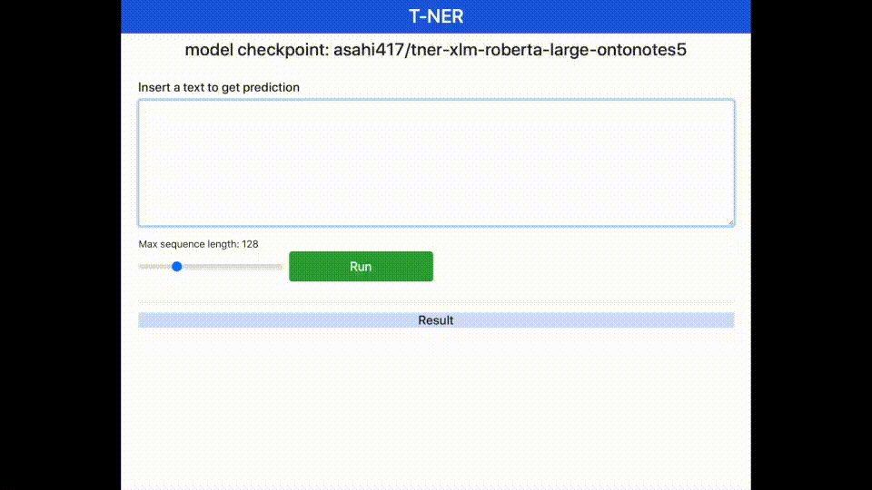

# Named Entity Recognition
This is a collection of scripts to fine-tuning pre-trained language models on Named-Entity-Recognition (NER) with [transformers](https://github.com/huggingface/transformers).
It also provides a quick App to test NER model with an interface, which is heavily inspired by [Multiple-Choice-Question-Generation-T5-and-Text2Text](https://github.com/renatoviolin/Multiple-Choice-Question-Generation-T5-and-Text2Text). 

## Get started
```bash
git clone https://github.com/asahi417/transformers-ner
cd transformers-ner
pip install -r requirement.txt
```

## Application


1. Download [model checkpoint file trained on OntoNote 5](https://drive.google.com/file/d/19SLaL_KMDXvI15oPlNRd6ZCNEdmypU7s/view?usp=sharing), 
and unzip the file, so that you have a default checkpoint folder `./ckpt/default`.
2. Run the app, and open your browser http://localhost:8000    

```bash
uvicorn app:app --reload --log-level debug --host 0.0.0.0 --port 8000
```

## Scripts
### model training

```bash
python example_train.py \
    --checkpoint-dir ./ckpt \
    -d ontonote5
```
- Wikiann dataset
First create a download folder with `mkdir -p ./cache` in the root of this project.
You then need to manually download panx_dataset (for NER) from [here](https://www.amazon.com/clouddrive/share/d3KGCRCIYwhKJF0H3eWA26hjg2ZCRhjpEQtDL70FSBN?_encoding=UTF8&%2AVersion%2A=1&%2Aentries%2A=0&mgh=1) 
(note that it will download as AmazonPhotos.zip) to the download directory. Finally, run the following command to download the remaining datasets:


### model testing
```bash
python example_train.py \
    --test \
    -c {path-to-checkpoint}
```


